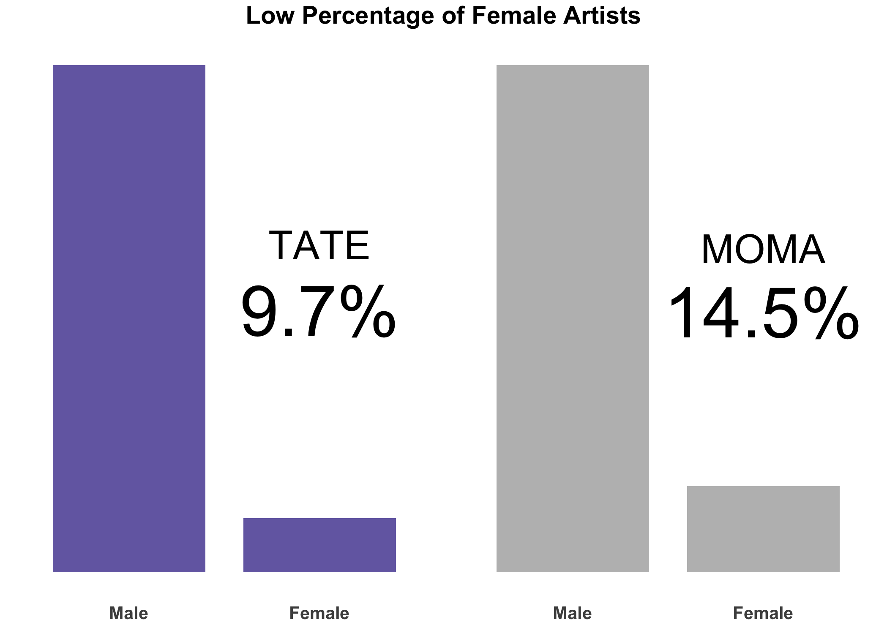
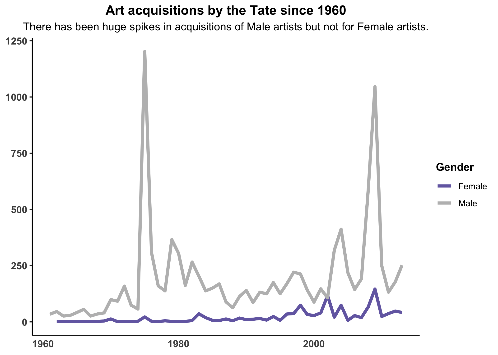
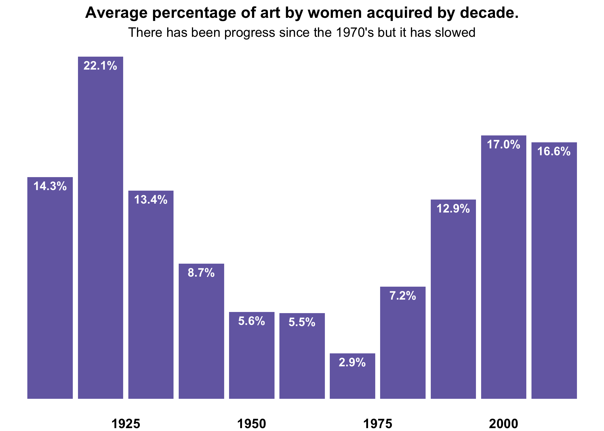
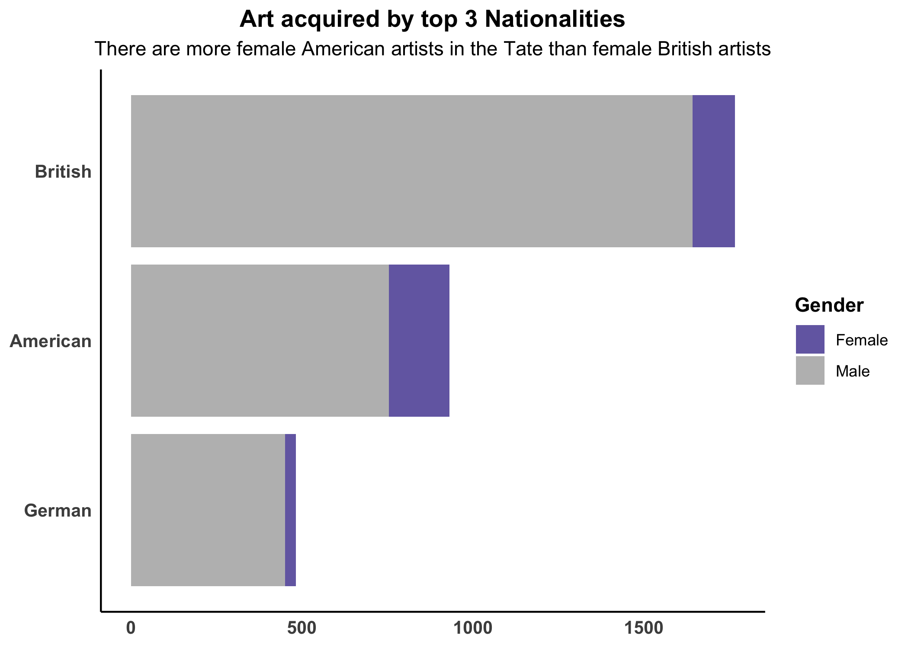

#Introduction

According to the National Museum of Women in the Arts, 51% of visual artists today are women. In the U.K., 66% of postgraduates in creative arts and design and over 64% of the employees at the Tate Galleries are women. However, when you walk through the Tate Modern in London it hardly feels like you are witnessing a new deluge of female artists. In fact, while equality has finally been achieved in some areas of the art world it has yet to make its way onto the walls of the world’s most prominent galleries.  Due to a long history of gender discrimination there are many galleries and museums that will never have a gender balanced collection. Nonetheless, art galleries with a substantive collection of modern art, like MOMA in New York and the Tate in London, can still achieve gender equality through equity focused acquisition strategies. Since the Tate is a charitable organization, as patrons and members, we can also do our part by holding the Tate accountable through data driven community activism and supporting exhibits that promote gender and racial equality in the arts.

#Where do we stand now?  

```{r echo=FALSE, out.width='65%', out.extra='style="float:right; padding:10px"'}

```

In the graph we can see that according to the most recent public data women artists make up only 9.7% of the Tate’s collection and 14.5% of MOMA’s. These are not promising numbers from an equity standpoint, but it is worth noting that we are trying to balance out hundreds of years of gender discrimination—these things take time. The most important consideration at this juncture is whether significant progress is being made to close this massive gender gap. 

#Is the Tate Making Progress?

Due to the fact that the Tate is lagging behind MOMA in terms of female artists, further examination will be conducted in order to determine whether or not progress is actually being made by the Tate. When we examine their yearly acquisition patterns we can see that there has beeen two significant years where a 
```{r echo=FALSE, out.width='65%', out.extra='style="float:left; padding:10px"'}

```
large amount of art by male artists was acquired. In both instances, however, there was not an accompanying uptick in acquisitions by female artists. However, it is important to consider that these large acquisition years may represent donations to the collection from a wealthy patron. In which case the Tate would have little control over the gender distribution of the gifted art. In 2002, there appeared to be a nice balance between male and female artist; unfortunately, this was the only time this has happened in over 100 years. 

From year to year the acquisition pattern of the Tate seems somewhat erratic, which hampers our ability to find significant evidence of progress toward gender equality in their collection. In order to account for this, we have graphed the average percentage of women artists acquired per decade. This allows us to better analyze the patterns in gender ratios over a longer period of time. However, it should be noted that while some of the ratios in the early 1900’s look great, these were times of great turmoil in Europe and very few pieces of art were acquired during this period.

```{r echo=FALSE, out.width='80%', fig.align='center'}
 
```

We can see by the graph above that the rate steadily decreased from the end of WWII in 1945 up until the 1970’s where it reached a low of 2.9% before beginning to rise again in the 1980’s. The 1980’s marked a turning point for England as a time of political and cultural revolution. This was a time when artists of African and Caribbean ancestry began to embrace their artistic roots and the British Black Arts Movement was born. These cultural shifts undoubtedly led the Tate to acquire more minority and female artists and we can see in the graph that there has been some progress. The important question is: are they moving fast enough? The percentages are still nowhere near 50% and in the 2010’s it has appeared to stagnate slightly at only 16.6%. This is exactly why it is important for the Tate membership and patrons to understand the trends and hold the Tate accountable when it begins to fall short of their own stated goals of a collection that reflects their community. 

#What can we do to help?

```{r echo=FALSE, out.width='65%', out.extra='style="float:right; padding:10px"'}

```
First, we can look at some of the components of the Tate’s collection, to see where the collection can grow moving forward. Apart from the gaps in gender we can see by the graph that while their collection is predominately British, they have more American female artists than British by a substantial margin. It would be fair to say that member advocacy should be focused on promoting more female exhibitions and acquiring more works by British women. There is a large pool of transcendent artists to choose from. Anyone from Bridget Riley and her works of abstract optical illusions to young black artists like Lynette Yiadon-Boakye who blends her cultural influences with the style of the Old Masters. It is an exciting time for art, with increased diversity, new outlets for expression and broader perspectives. It is important that the walls of our great galleries reflect this excitement and as art lovers we can have a role in insuring that happens.  Knowledge is the key to effective activism. We learn what we can from the data so that you can influence change and be better, more engaged, community members.
